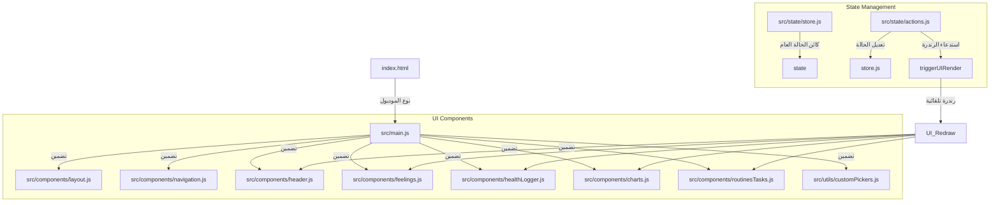

# 🤖 دليل بنية وهيكل المشروع للذكاء الاصطناعي (AI Codebase Context & Architecture)

هذا الملف عبارة عن خريطة مرجعية شاملة مصممة خصيصاً لمساعدي الذكاء الاصطناعي (AI Coding Assistants) لفهم معمارية تطبيق **"أعمل ايه !؟" (Eleven Health)** وإجراء التعديلات والإضافات بدقة وسرعة 100% دون التسبب في أي أعطال أو تعارضات.

---

## 🌟 1. نظرة عامة على التطبيق (Overview)
- **الاسم:** أعمل ايه !؟ (Eleven Health).
- **التصميم:** واجهة تجميلية تحريرية فاخرة وبسيطة (Minimalist Premium Editorial) تعتمد على النمط الدافئ المحايد (Warmgray palette - HSL tailormade) والواجهات ثلاثية الأبعاد خفيفة الوزن ونظام النوافذ المنبثقة المغبشة المعتمة.
- **التقنية الأساسية:** تطبيق ويب ثابت خفيف يعمل بالكامل عبر المتصفح باستخدام **ES Modules (ESM)** الصافية بدون الحاجة لأدوات بناء معقدة (No bundlers like Webpack/Vite).
- **التنسيق والمكتبات:** Tailwind CSS و Lucide Icons عن طريق الـ CDNs المدمجة في المدخل الرئيسي.

---

## 📂 2. هيكل شجرة المجلدات والملفات (Directory Tree)
```text
اعمل اي v2/
├── index.html                 # المدخل الرئيسي للتطبيق، تهيئة Tailwind، وتحميل الـ CDNs
├── AI_CONTEXT.md              # هذا الملف (دليل معمارية المشروع للـ AI)
├── src/
│   ├── main.js                # منسق دورة الحياة العام وبادئ التشغيل ومستورد المكونات الجانبية
│   ├── style.css              # التنسيقات المخصصة (أشرطة التمرير، الأنيميشن، الـ Range Sliders)
│   │
│   ├── state/                 # طبقة البيانات وإدارة الحالة (Data Layer)
│   │   ├── store.js           # كائن الحالة الموحد (Singleton State)، الحفظ المحلي، وترقية البيانات (Migration)
│   │   └── actions.js         # العمليات ومغيرات الحالة (State Mutators & Reactive Trigger)
│   │
│   ├── components/            # مكونات واجهة المستخدم التفاعلية (UI Components)
│   │   ├── header.js          # ترويسة الترحيب المخصصة ودائرة تقدم إنجاز اليوم (SVG Loader)
│   │   ├── feelings.js        # شبكة المشاعر والأحاسيس الحالية، فلاتر التصنيفات، وكارت الإضافة المدمج
│   │   ├── actionStack.js     # كوتشينة خطوات العلاج المقترحة، حركات السحب (Swipe)، ودرج المؤجلات
│   │   ├── healthLogger.js    # السجل اليومي الجانبي (المزاج، النوم، مذكرات اليوم، العادات، والمهمات اليومية)
│   │   ├── charts.js          # المخطط البياني التفاعلي Bezier SVG مع الـ Tooltips
│   │   ├── toast.js           # نظام الإشعارات السريعة الأنيقة (Premium Toast alerts)
│   │   │
│   │   /* المكونات المفككة الحديثة لتبسيط حجم الأكواد وسهولة التطوير */
│   │   ├── layout.js          # حقن الـ Layout والـ Skeleton HTML والنوافذ ونظام قفل الأمان (PIN Lock)
│   │   ├── navigation.js      # نظام الملاحة والتنقل بين الصفحات والتحكم بشريط الموبايل السفلي
│   │   ├── symptomDetails.js  # تفاصيل الشعور المحدد، التحكم بالتبويبات، وعرض كل الخطوات
│   │   ├── routinesTasks.js   # اللوحة الذكية للروتين والعادات والمهام اليومية مع تقاويمها التفاعلية
│   │   ├── iconPicker.js      # محرك اختيار الأيقونات البصرية وتصفيتها والبحث المتقدم
│   │   ├── settingsModal.js   # نافذة إعدادات النظام ومزامنة P2P وتفعيل/تعطيل قفل PIN المكون من 6 أرقام
│   │   ├── ratingModal.js     # ميكرو-مودال تقييم فاعلية الخطوة المنجزة وسرعة مفعولها بالنجوم
│   │   ├── addEntryModal.js   # النوافذ المنبثقة لإضافة عناصر جديدة سياقياً (FAB) بدعم الـ Custom Pickers
│   │   ├── editEntryModal.js  # النوافذ المنبثقة لتعديل أو حذف العناصر (روتين، مهام، فئة، مؤشر، شعور)
│   │   └── modals.js          # المجمع والموزع المركزي لكافة النوافذ الفرعية
│   │
│   ├── services/              # الخدمات والمنطق البرمجي المتقدم (Services)
│   │   ├── sync.js            # بروتوكول المزامنة اللحظية Peer-to-Peer اللامركزي
│   │   └── analytics.js       # خوارزميات الذكاء الاستنتاجي والارتباطات وتحديث فلتر المشاعر
│   │
│   └── utils/                 # دوال مساعدة عامة (Helper Utilities)
│       ├── dom.js             # دوال اختيار عناصر الـ DOM والتلاعب بها ($ و $$)
│       ├── icons.js           # قاعدة بيانات الأيقونات ومحرك البحث المرئي المدمج
│       └── customPickers.js   # نظام البوب-أب المركزي لتجميل القوائم والتقاويم وشبكة الوقت التفاعلية
```

---

## 🔄 3. خريطة الاعتماديات والتدفق (Dependency & Flow Map)
عمل التطبيق وفق تدفق أحادي الاتجاه للبيانات (Unidirectional Data Flow) لإعادة رندرة المكونات عند تعديل الحالة:



---

## 🛡️ 4. الميزات الاستراتيجية الحديثة (Strategic Core Upgrades)

### 🔒 أ. نظام قفل الأمان والخصوصية (PIN Security Lock)
* **الوظيفة**: تأمين التطبيق بالكامل وحجب الشاشة عند بدء الدخول عن طريق رمز PIN فريد مكون من 6 أرقام.
* **المسار التفاعلي**:
  * حقن الشاشة في `layout.js` والتنفيذ المباشر للأزرار الرقمية من 0 إلى 9 وزر التصفير والحذف.
  * دعم الإدخال عبر لوحة المفاتيح الفعلية (Physical Keyboard Listener) بمراقبة مفاتيح الأرقام و Backspace و Escape.
  * تفعيل وتعطيل القفل بمرونة من نافذة الإعدادات مع إجبار المستخدم على مطابقة الرمز الحالي لتعطيله بصورة آمنة.

### 📅 ب. نظام الروتين والعادات والمهام اليومية والكل (Routines & Tasks)
* **الروتين (Routines)**: كروت أنيقة مبنية بالكامل في `routinesTasks.js` تعرض الهدف الأساسي، الأيقونة التعبيرية، والعلة المستهدف حلها.
  * **سلسلة الالتزام (Flame Streak)**: محرك ذكي يحسب سلسلة الالتزام اليومية المتواصلة بالأيام لتشجيع المستخدم.
  * **التقويم التفاعلي الرجعي (Retrospective Calendar)**: تقويم مدمج داخل كارت كل عادة على حدة يتيح للمستخدم النقر لتسجيل الإنجاز، أو النقر على أي يوم سابق لتسجيل/إلغاء التزامه بأثر رجعي بكل مرونة.
* **المهام الفردية (Tasks)**:
  * **الفلترة الذكية**: تعرض فقط المهام المستحقة لليوم لحماية ذهن المستخدم من الازدحام والتشتت، مع إتاحة زر "عرض الكل" لمشاهدة كافة المهام.
  * **تنبيهات التأخر**: يظهر وسم "متأخرة! ⚠️" باللون الأحمر الخفيف للمهمات التي انقضى تاريخ استحقاقها دون إنجازها.
* **CRUD بالكامل**: مدعوم كلياً في شاشات الإضافة والتعديل السياقية بمزامنة لحظية.

### 🎨 ج. منتقيات الاختيار والتقاويم والوقت المخصصة والمنبثقة (Centered Premium Picker Popups)
* **بوب-أب مركزي معتم ومغبش (`custom-picker-modal`)**:
  * بدلاً من النوافذ المطلقة الملتصقة بالعناصر التي تتعرض للقص على الشاشات الصغيرة، تم ابتكار بوب-أب مركزي فاخر يفتح في منتصف الشاشة مع خلفية مغبشة رائعة (`backdrop-blur-[2.5px]`) وتأثير حركة سلس للظهور والتلاشي.
* **منتقي القوائم (Select Picker)**: يعرض كافة الخيارات كأزرار كبيرة ومريحة للإصبع داخل البوب-أب مع إضاءة الخيار المحدد مسبقاً وتظليله باللون الأسود ورمزه المختار.
* **منتقي الوقت الخالي من القوائم الافتراضية (Touch Grid Time Picker)**:
  * للتخلص من واجهات المتصفح الزرقاء المزعجة، تم بناء ثلاث شبكات تفاعلية للأصابع داخل البوب-أب:
    1. **الساعة**: شبكة من 12 زراً دائرياً (01 إلى 12).
    2. **الدقيقة**: شبكة من 12 زراً دائرياً بزيادة 5 دقائق (00 إلى 55).
    3. **الفترة**: مفتاح تبديل ثنائي كبير للصباح والمساء (ص / م).
  * بمجرد النقر، تتغير الأزرار برمجياً ومظهرها بشكل فوري مع حفظ القيمة عند النقر على "تأكيد الوقت".
* **منتقي التاريخ الفاخر (Centered Date Picker)**: يعرض تقويم الشهر وأزرار التنقل بين الشهور والأيام بمتسع ووضوح تام داخل المودال دون الخروج عن الشاشة.

---

## 🛡️ 5. قواعد ومبادئ المعمارية الذهبية (Architecture Rules)

### 📌 أ. الامتثال الصارم لـ ES Modules بالمتصفح
- بما أننا لا نستخدم Bundler، **يجب دائماً كتابة الامتداد `.js` في نهاية كل استيراد (Import)**.
  - *صحيح:* `import { state } from '../state/store.js';`
  - *خاطئ:* `import { state } from '../state/store';`

### 📌 ب. جسر الربط بالنطاق العام (Global Bindings Bridge)
- تقوم ES Modules بعزل النطاق البرمجي للملف، مما يمنع المتصفح من التعرف على أحداث HTML المدمجة مثل `onclick="..."` في الـ HTML المصنع ديناميكياً.
- **الحل المعتمد:** تصدير الدوال وربطها بكائن `window` العام في نهاية كل ملف موديول تفاعلي (مثال: `window.toggleRoutineComplete = toggleRoutineComplete;`).
- **تنبيه هام للـ AI:** عند إنشاء دالة تفاعلية جديدة، تأكد من إضافتها لكائن `window` في نهاية موديولها لتفادي حدوث خطأ `ReferenceError` بالمتصفح.

### 📌 ج. دورة رندرة الواجهة التفاعلية (Reactive Pipeline)
- عند رغبتك في تعديل أي بيانات في الحالة `state` (مثل عادات، مشاعر، مهام)، **لا تقم بتعديلها يدوياً من المكون مباشرة**.
- استدعِ دالة متخصصة من `actions.js`. تقوم هذه الدوال بـ:
  1. تعديل كائن الحالة المشترك `state`.
  2. استدعاء `saveState(showToastPopup)` لحفظ البيانات محلياً وإرسالها للمزامنة.
  3. استدعاء `triggerUIRender()` الذي يقوم بتوجيه المكونات النشطة لتحديث محتويات شاشتها تلقائياً.

---

## 🛠️ 6. كيف تقوم بإضافة ميزة جديدة بأمان؟ (How to Add a Feature)

إذا أردت إضافة مدخل أو ميزة جديدة، اتبع هذا التسلسل الصارم:
1. **أضف هيكل البيانات:** في `src/state/store.js` داخل `getInitialDefaultState()` والترقية في `migrateState()`.
2. **أضف منطق العمليات:** في `src/state/actions.js` لتحديث الميزة مع استدعاء الحفظ والرندرة.
3. **أضف حقول الإدخال:** في `src/components/addEntryModal.js` أو `src/components/editEntryModal.js` بداخل منطق رندرة الفورم المناسب وسياقه، ولا تنسَ تشغيل `applyCustomPickers(formFields)` لتجميل المدخلات.
4. **أضف المكون البصري:** في المكون المتخصص وعرفه في `window` لعرض التغييرات فوراً.
5. **اربط المكون:** تأكد من أن ملف المكون مستورد في [main.js](file:///c:/Users/emoha/اعمل%20اي%20v2/src/main.js) ليعمل side-effect الخاص به في المتصفح.

**جاهز دائماً لتعديل "أعمل ايه !؟" بأعلى معايير الدقة والجمال والابتكار! 🚀**
